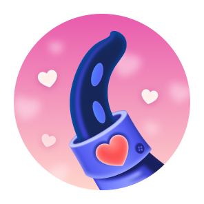
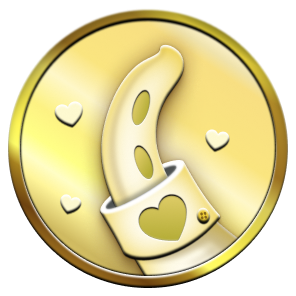
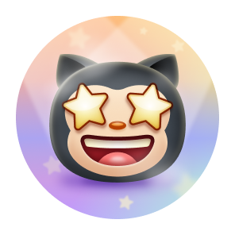
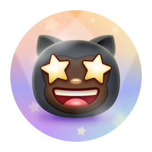
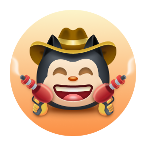
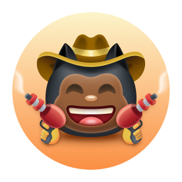

<div align="center">

# 🏆 GitHub Profile Achievements — Complete Guide

**Every badge. Every tier. Every requirement.**
*The most comprehensive and up-to-date reference for GitHub profile achievements.*

<br>


<br><br>

[](https://github.com/YOUR_USERNAME/GitHub-Achievements/stargazers)
[](LICENSE)

</div>

---

<details>
<summary><strong>📋 Table of Contents</strong> (click to expand)</summary>

- [Achievement Badges](#-achievement-badges)
- [How to Earn Each Badge](#-how-to-earn-each-badge)
- [Beta Badges](#-beta-badges)
- [Retired Badges](#-retired-badges)
- [Highlight Badges](#-highlight-badges)
- [Skin Tone Variants](#-skin-tone-variants)
- [Settings & Display](#%EF%B8%8F-settings--display)

</details>

---

## 🏅 Achievement Badges

### Tiered Achievements

<table>
  <thead>
    <tr>
      <th>Badge</th>
      <th>Name</th>
      <th>How to Earn</th>
      <th>DEFAULT</th>
      <th>🥉 BRONZE</th>
      <th>🥈 SILVER</th>
      <th>🥇 GOLD</th>
    </tr>
  </thead>
  <tbody>
    <tr>
      <td align="center"></td>
      <td><strong>Starstruck</strong></td>
      <td>Created a repository that has many stars</td>
      <td align="center"><br><code>16</code></td>
      <td align="center"><br><code>128</code></td>
      <td align="center"><br><code>512</code></td>
      <td align="center"><br><code>4096</code></td>
    </tr>
    <tr>
      <td align="center"></td>
      <td><strong>Pull Shark</strong></td>
      <td>Opened a pull request that has been merged</td>
      <td align="center"><br><code>2</code></td>
      <td align="center"><br><code>16</code></td>
      <td align="center"><br><code>128</code></td>
      <td align="center"><br><code>1024</code></td>
    </tr>
    <tr>
      <td align="center"></td>
      <td><strong>Galaxy Brain</strong></td>
      <td>Answered a discussion and got an accepted answer</td>
      <td align="center"><br><code>2</code></td>
      <td align="center"><br><code>8</code></td>
      <td align="center"><br><code>16</code></td>
      <td align="center"><br><code>32</code></td>
    </tr>
    <tr>
      <td align="center"></td>
      <td><strong>Pair Extraordinaire</strong></td>
      <td><a href="https://docs.github.com/pull-requests/committing-changes-to-your-project/creating-and-editing-commits/creating-a-commit-with-multiple-authors">Coauthored</a> commits on a merged pull request</td>
      <td align="center"><br><code>1</code></td>
      <td align="center"><br><code>10</code></td>
      <td align="center"><br><code>24</code></td>
      <td align="center"><br><code>48</code></td>
    </tr>
  </tbody>
</table>

### Single-Tier Achievements

<table>
  <thead>
    <tr>
      <th>Badge</th>
      <th>Name</th>
      <th>How to Earn</th>
    </tr>
  </thead>
  <tbody>
    <tr>
      <td align="center"></td>
      <td><strong>Quickdraw</strong></td>
      <td>Gitty up! Closed an issue or pull request within 5 minutes of opening</td>
    </tr>
    <tr>
      <td align="center"></td>
      <td><strong>YOLO</strong></td>
      <td>Merged a pull request without a code review</td>
    </tr>
    <tr>
      <td align="center"></td>
      <td><strong>Public Sponsor</strong></td>
      <td>Sponsored an open source contributor through <a href="https://github.com/sponsors">GitHub Sponsors</a></td>
    </tr>
  </tbody>
</table>

---

## 🔍 How to Earn Each Badge

<details>
<summary> <strong>Starstruck</strong></summary>

<br>

Create a **public repository** that other developers find valuable enough to star. The base badge unlocks at **16 stars** — higher tiers reward increasingly popular repos up to 4,096 stars.

**Tips:**
- Build something that solves a real problem — utilities, templates, guides, or dev tools
- Write a clear README with usage examples and screenshots
- Share your work in relevant communities and on social media
- Consistency matters: maintain and update your repo over time

| Tier | Stars Required |
|---|---|
| Default | 16 |
| 🥉 Bronze | 128 |
| 🥈 Silver | 512 |
| 🥇 Gold | 4,096 |

</details>

<details>
<summary> <strong>Pull Shark</strong></summary>

<br>

Open pull requests on **any repository** (including your own) and get them **merged**. The base badge requires just **2 merged PRs**.

**Tips:**
- Contribute bug fixes, documentation, or features to open source projects
- Even small typo fixes count as merged PRs
- Your own repos count too — useful for solo developers
- Look for repos with `good first issue` labels to get started

| Tier | Merged PRs Required |
|---|---|
| Default | 2 |
| 🥉 Bronze | 16 |
| 🥈 Silver | 128 |
| 🥇 Gold | 1,024 |

</details>

<details>
<summary> <strong>Galaxy Brain</strong></summary>

<br>

Participate in **GitHub Discussions** (specifically the Q&A category). When a question author marks your answer as **accepted**, it counts toward this badge. You need **2 accepted answers** to start.

**Tips:**
- Look for unanswered questions in repos you're familiar with
- Provide clear, well-formatted answers with code examples
- Repos must have Discussions enabled with the Q&A category active
- Focus on popular repos where questions get frequent traffic

| Tier | Accepted Answers Required |
|---|---|
| Default | 2 |
| 🥉 Bronze | 8 |
| 🥈 Silver | 16 |
| 🥇 Gold | 32 |

</details>

<details>
<summary> <strong>Pair Extraordinaire</strong></summary>

<br>

Add a **co-author trailer** to a commit message in a merged pull request:

```
Co-authored-by: Name <email@example.com>
```

This works when you collaborate with another developer on a commit. You need just **1 co-authored merged PR** for the base badge.

**Tips:**
- This badge rewards genuine pair programming and collaboration
- The co-author must have a valid GitHub account linked to that email
- Works on any repository, including private ones

| Tier | Co-authored Merged PRs Required |
|---|---|
| Default | 1 |
| 🥉 Bronze | 10 |
| 🥈 Silver | 24 |
| 🥇 Gold | 48 |

</details>

<details>
<summary> <strong>Quickdraw</strong></summary>

<br>

Open an issue or pull request and close it **within 5 minutes**. That's it — speed is all that matters. No tiers, just a single badge.

**Tip:** This is often earned accidentally, but you can do it intentionally on any repo you have write access to.

</details>

<details>
<summary> <strong>YOLO</strong></summary>

<br>

Merge a pull request that has **no reviews at all** — no approvals, no comments, no change requests. Living dangerously.

**Note:** This is easiest on your own repos where branch protection rules don't require reviews.

</details>

<details>
<summary> <strong>Public Sponsor</strong></summary>

<br>

Go to [GitHub Sponsors](https://github.com/sponsors) and sponsor **any** open source contributor or organization. Even a $1/month sponsorship qualifies.

**Tip:** Your sponsorship must be set to **public** (not private) to earn the badge.

</details>

---

## 🧪 Beta Badges

These badges have been spotted in testing but aren't fully rolled out. Requirements and tier thresholds may change.

<table>
  <thead>
    <tr>
      <th>Badge</th>
      <th>Name</th>
      <th>Likely Requirement</th>
      <th>DEFAULT</th>
      <th>🥉 BRONZE</th>
      <th>🥈 SILVER</th>
      <th>🥇 GOLD</th>
    </tr>
  </thead>
  <tbody>
    <tr>
      <td align="center"></td>
      <td><strong>Heart On Your Sleeve</strong></td>
      <td>React with ❤️ to content on GitHub</td>
      <td align="center"><br><code>?</code></td>
      <td align="center"><br><code>?</code></td>
      <td align="center"><br><code>?</code></td>
      <td align="center"><br><code>?</code></td>
    </tr>
    <tr>
      <td align="center"></td>
      <td><strong>Open Sourcerer</strong></td>
      <td>Have PRs merged in multiple public repos you don't own</td>
      <td align="center"><br><code>?</code></td>
      <td align="center"><br><code>?</code></td>
      <td align="center"><br><code>?</code></td>
      <td align="center"><br><code>?</code></td>
    </tr>
  </tbody>
</table>

> **⚠️ Note:** These badges may appear and disappear from profiles as GitHub experiments with them.

---

## 🧊 Retired Badges

These badges are **no longer obtainable** — they were tied to one-time historical events.

<table>
  <thead>
    <tr>
      <th>Badge</th>
      <th>Name</th>
      <th>Original Requirement</th>
    </tr>
  </thead>
  <tbody>
    <tr>
      <td align="center"></td>
      <td><strong>Mars 2020 Contributor</strong></td>
      <td>Contributed code to a repository used in the <a href="https://github.com/readme/featured/nasa-ingenuity-helicopter">Mars 2020 Helicopter Mission</a></td>
    </tr>
    <tr>
      <td align="center"></td>
      <td><strong>Arctic Code Vault Contributor</strong></td>
      <td>Contributed code to a repository in the <a href="https://archiveprogram.github.com/">2020 GitHub Archive Program</a></td>
    </tr>
  </tbody>
</table>

---

## ✨ Highlight Badges

Highlight badges appear separately from achievements and represent **program memberships or recognitions**.

<table>
  <thead>
    <tr>
      <th>Badge</th>
      <th>Name</th>
      <th>How to Get</th>
    </tr>
  </thead>
  <tbody>
    <tr>
      <td align="center">
        <picture>
          <source media="(prefers-color-scheme: light)" srcset="Media/Highlights/GitHub-Pro/SVG/GitHub-Pro_DarkMode.svg">
          
        </picture>
      </td>
      <td><strong>Pro</strong></td>
      <td>Subscribe to <a href="https://docs.github.com/en/get-started/learning-about-github/githubs-products#github-pro">GitHub Pro</a></td>
    </tr>
    <tr>
      <td align="center">
        <picture>
          <source media="(prefers-color-scheme: light)" srcset="Media/Highlights/Developer-Program-Member/SVG/DeveloperProgramMember_DarkMode.svg">
          
        </picture>
      </td>
      <td><strong>Developer Program Member</strong></td>
      <td>Join the <a href="https://docs.github.com/en/developers/overview/github-developer-program">GitHub Developer Program</a></td>
    </tr>
    <tr>
      <td align="center">
        <picture>
          <source media="(prefers-color-scheme: light)" srcset="Media/Highlights/Security-Bug-Bounty-Hunter/SVG/Security-Bug-Bounty-Hunter_DarkMode.svg">
          
        </picture>
      </td>
      <td><strong>Security Bug Bounty Hunter</strong></td>
      <td>Find vulnerabilities through <a href="https://bounty.github.com/">GitHub Security</a></td>
    </tr>
    <tr>
      <td align="center">
        <picture>
          <source media="(prefers-color-scheme: light)" srcset="Media/Highlights/GitHub-Campus-Expert/SVG/GitHub-Campus-Expert_DarkMode.svg">
          
        </picture>
      </td>
      <td><strong>GitHub Campus Expert</strong></td>
      <td>Participate in the <a href="https://education.github.com/experts">GitHub Campus Program</a></td>
    </tr>
    <tr>
      <td align="center">
        <picture>
          <source media="(prefers-color-scheme: light)" srcset="Media/Highlights/Security-Advisory-Credit/SVG/Security-Advisory-Credit_DarkMode.svg">
          
        </picture>
      </td>
      <td><strong>Security Advisory Credit</strong></td>
      <td>Have your advisory submitted to the <a href="https://github.com/advisories">GitHub Advisory Database</a> accepted</td>
    </tr>
  </tbody>
</table>

---

## 👋 Skin Tone Variants

Some achievements support **emoji skin tone customization**. Change yours in [appearance settings](https://github.com/settings/appearance).

<details>
<summary><strong>Starstruck Skin Tones</strong></summary>

<br>

<table>
  <thead>
    <tr>
      <th>👋</th>
      <th>👋🏻</th>
      <th>👋🏼</th>
      <th>👋🏽</th>
      <th>👋🏾</th>
      <th>👋🏿</th>
    </tr>
  </thead>
  <tbody>
    <tr>
      <td align="center"></td>
      <td align="center"></td>
      <td align="center"></td>
      <td align="center"></td>
      <td align="center"></td>
      <td align="center"></td>
    </tr>
  </tbody>
</table>

</details>

<details>
<summary><strong>Quickdraw Skin Tones</strong></summary>

<br>

<table>
  <thead>
    <tr>
      <th>👋</th>
      <th>👋🏻</th>
      <th>👋🏼</th>
      <th>👋🏽</th>
      <th>👋🏾</th>
      <th>👋🏿</th>
    </tr>
  </thead>
  <tbody>
    <tr>
      <td align="center"></td>
      <td align="center"></td>
      <td align="center"></td>
      <td align="center"></td>
      <td align="center"></td>
      <td align="center"></td>
    </tr>
  </tbody>
</table>

</details>

---

## ⚙️ Settings & Display

- Achievements are **visible by default** on your public profile
- Toggle them off in [Profile Settings](https://github.com/settings)
- Change skin tone preferences in [Appearance Settings](https://github.com/settings/appearance)
- Official docs: [Personalizing your profile](https://docs.github.com/en/account-and-profile/setting-up-and-managing-your-github-profile/customizing-your-profile/personalizing-your-profile#displaying-badges-on-your-profile)

---

<div align="center">

### ⭐ Found this useful? Star this repo to help others find it!

<br>

Made with ❤️ for the GitHub community

[MIT License](LICENSE)

</div>
